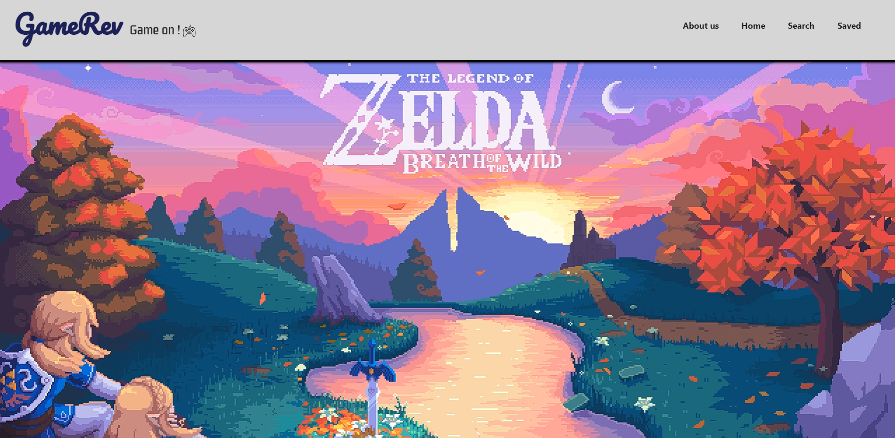

  <h1># GameRev!</h1>

## First react app full project

#### This is my first project utilizing react.js and creating a full-stack website. 
#### The project is a Video games recommendation, with the option to search, filter, and save games to the user list. 
#### The project is not using a database, but I might add it in the future. 
#### The site was deployed using firebase. 

<h2 align="center">ScreenShots section:</h2>

  

  

  

<h2 align="center">Click here for the project!</h2>

### Thank you for your interest,
### Ben Daniels.
